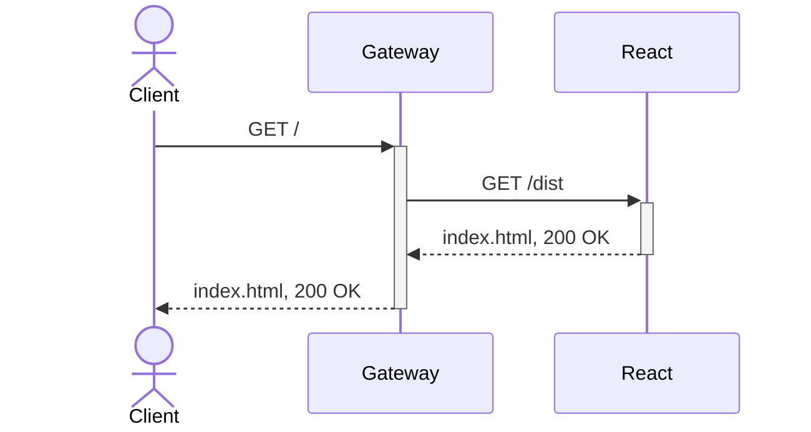

# Platformatic workshop

[Platformatic](https://platformatic.dev/) is the out-of-the-box, open source primitive to build & run [Node.js](https://nodejs.org/) applications.

Focus on building your [Node.js](https://nodejs.org/) applications, not building around them.

site: [platformatic.dev](https://platformatic.dev/)

doc: [Reference](https://platformatic.dev/docs/Overview)

## Prerequisites

- [Node.js](https://nodejs.org/) >= v22.19.0
- [npm](https://docs.npmjs.com/cli/) v10 or later
- [pnpm](https://pnpm.io/) v10 or later
- A code editor, for example [Visual Studio Code](https://code.visualstudio.com/)

## Workshop 1 - frontend & gateway

How to start with a frontend and expose it with the gateway application...

- learn to use the wattpm CLI
- learn to kickoff a watt project
- learn how to expose an application with the gateway application
- learn development mode with watch/ hot-reload and production mode

## Further examples to learn platformatic

- [Examples to help you learn how to build with Platformatic open-source tools.](https://github.com/platformatic/examples)
